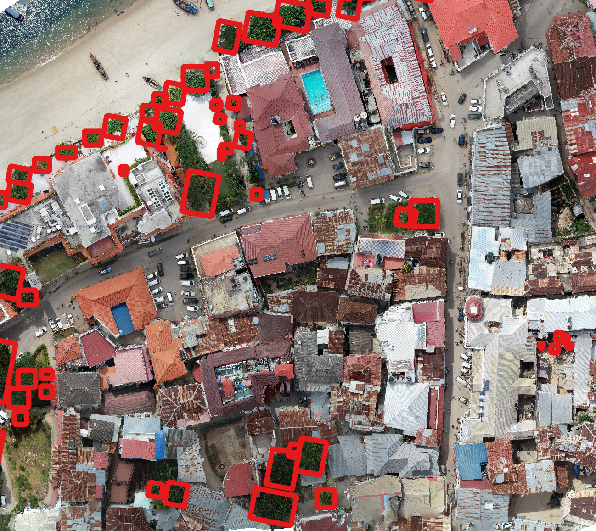

# Contact Email Drafts (Request-Only Sources)

These are brief draft emails for sources that appear request-only or contact-author in the worksheet.
Each draft includes project context, manuscript invitation language, and geospatial privacy statement.

## Automated detection of koalas using low-level aerial surveillance and machine learning
- To: g.hamilton@qut.edu.au
- Worksheet link: https://www.nature.com/articles/s41598-019-39917-5

Subject: MillionAnimals dataset collaboration request

Hello, we are building MillionAnimals, an open benchmark for airborne animal detection, and we are currently reviewing `Automated detection of koalas using low-level aerial surveillance and machine learning` for inclusion.
If sharing is possible, we would be grateful for access to the imagery and annotations (or guidance on your preferred access path).
All contributing dataset authors will be invited to co-author the manuscript, and all geospatial information is removed from released data products to protect re-use.
A sample benchmark image is shown above for context.
Thank you for considering this request.

## Using Web images to train a deep neural network to detect sparsely distributed wildlife in large volumes of remotely sensed imagery: A case study of polar bears on sea ice
- To: dominique.chabot@mail.mcgill.ca
- Worksheet link: https://www.sciencedirect.com/science/article/pii/S1574954121003381

Subject: MillionAnimals dataset collaboration request

Hello, we are building MillionAnimals, an open benchmark for airborne animal detection, and we are currently reviewing `Using Web images to train a deep neural network to detect sparsely distributed wildlife in large volumes of remotely sensed imagery: A case study of polar bears on sea ice` for inclusion.
If sharing is possible, we would be grateful for access to the imagery and annotations (or guidance on your preferred access path).
All contributing dataset authors will be invited to co-author the manuscript, and all geospatial information is removed from released data products to protect re-use.
A sample benchmark image is shown above for context.
Thank you for considering this request.

## Developing a new method using thermal drones for population surveys of the world's rarest great ape species, Pongo tapanuliensis
- To: dedeaulia@apps.ipb.ac.id
- Worksheet link: https://www.researchgate.net/publication/388430386_Developing_a_new_method_using_thermal_drones_for_population_surveys_of_the_world's_rarest_great_ape_species_Pongo_tapanuliensis

Subject: MillionAnimals dataset collaboration request

Hello, we are building MillionAnimals, an open benchmark for airborne animal detection, and we are currently reviewing `Developing a new method using thermal drones for population surveys of the world's rarest great ape species, Pongo tapanuliensis` for inclusion.
If sharing is possible, we would be grateful for access to the imagery and annotations (or guidance on your preferred access path).
All contributing dataset authors will be invited to co-author the manuscript, and all geospatial information is removed from released data products to protect re-use.
A sample benchmark image is shown above for context.
Thank you for considering this request.

## Developing a new method using thermal drones for population surveys of the world's rarest great ape species, Pongo tapanuliensis
- To: dedeaulia@apps.ipb.ac.id
- Worksheet link: https://www.sciencedirect.com/science/article/pii/S2351989425000642

Subject: MillionAnimals dataset collaboration request

Hello, we are building MillionAnimals, an open benchmark for airborne animal detection, and we are currently reviewing `Developing a new method using thermal drones for population surveys of the world's rarest great ape species, Pongo tapanuliensis` for inclusion.
If sharing is possible, we would be grateful for access to the imagery and annotations (or guidance on your preferred access path).
All contributing dataset authors will be invited to co-author the manuscript, and all geospatial information is removed from released data products to protect re-use.
A sample benchmark image is shown above for context.
Thank you for considering this request.

## Artificial intelligence for automated detection of large mammals creates path to upscale drone surveys
- To: javier.lenzi@und.edu
- Worksheet link: https://www.nature.com/articles/s41598-023-28240-9

Subject: MillionAnimals dataset collaboration request

Hello, we are building MillionAnimals, an open benchmark for airborne animal detection, and we are currently reviewing `Artificial intelligence for automated detection of large mammals creates path to upscale drone surveys` for inclusion.
If sharing is possible, we would be grateful for access to the imagery and annotations (or guidance on your preferred access path).
All contributing dataset authors will be invited to co-author the manuscript, and all geospatial information is removed from released data products to protect re-use.
A sample benchmark image is shown above for context.
Thank you for considering this request.

## Using YOLO Object Detection to Identify Hare and Roe Deer in Thermal Aerial Video Footage—Possible Future Applications in Real-Time Automatic Drone Surveillance and Wildlife Monitoring
- To: ppov@bio.aau.dk
- Worksheet link: https://www.mdpi.com/2504-446X/8/1/2

Subject: MillionAnimals dataset collaboration request

Hello, we are building MillionAnimals, an open benchmark for airborne animal detection, and we are currently reviewing `Using YOLO Object Detection to Identify Hare and Roe Deer in Thermal Aerial Video Footage—Possible Future Applications in Real-Time Automatic Drone Surveillance and Wildlife Monitoring` for inclusion.
If sharing is possible, we would be grateful for access to the imagery and annotations (or guidance on your preferred access path).
All contributing dataset authors will be invited to co-author the manuscript, and all geospatial information is removed from released data products to protect re-use.
A sample benchmark image is shown above for context.
Thank you for considering this request.

## ADD-YOLO: An algorithm for detecting animals in outdoor environments based on unmanned aerial imagery
- To: wlf800@126.com
- Worksheet link: https://www.sciencedirect.com/science/article/pii/S0263224124019043?casa_token=5ZBofbcLv-EAAAAA:dIgZhQIenfwt-oPLqi1-_4veJPpcM4NXjRv5awmToQihA4leUDoytQ3Wm5T69MNnmTGiedBMuhY

Subject: MillionAnimals dataset collaboration request

Hello, we are building MillionAnimals, an open benchmark for airborne animal detection, and we are currently reviewing `ADD-YOLO: An algorithm for detecting animals in outdoor environments based on unmanned aerial imagery` for inclusion.
If sharing is possible, we would be grateful for access to the imagery and annotations (or guidance on your preferred access path).
All contributing dataset authors will be invited to co-author the manuscript, and all geospatial information is removed from released data products to protect re-use.
A sample benchmark image is shown above for context.
Thank you for considering this request.

## Wildlife target detection based on improved YOLOX-s network
- To: zhangna@zstu.edu.cn
- Worksheet link: https://www.nature.com/articles/s41598-024-73631-1

Subject: MillionAnimals dataset collaboration request

Hello, we are building MillionAnimals, an open benchmark for airborne animal detection, and we are currently reviewing `Wildlife target detection based on improved YOLOX-s network` for inclusion.
If sharing is possible, we would be grateful for access to the imagery and annotations (or guidance on your preferred access path).
All contributing dataset authors will be invited to co-author the manuscript, and all geospatial information is removed from released data products to protect re-use.
A sample benchmark image is shown above for context.
Thank you for considering this request.

## Temporal Insights into Ecological Community: Advancing Waterbird Monitoring with Dome Camera and Deep Learning
- To: panmin333@foxmail.com
- Worksheet link: https://papers.ssrn.com/sol3/papers.cfm?abstract_id=5113459

Subject: MillionAnimals dataset collaboration request

Hello, we are building MillionAnimals, an open benchmark for airborne animal detection, and we are currently reviewing `Temporal Insights into Ecological Community: Advancing Waterbird Monitoring with Dome Camera and Deep Learning` for inclusion.
If sharing is possible, we would be grateful for access to the imagery and annotations (or guidance on your preferred access path).
All contributing dataset authors will be invited to co-author the manuscript, and all geospatial information is removed from released data products to protect re-use.
A sample benchmark image is shown above for context.
Thank you for considering this request.

## Automated Detection of Animals in Low-Resolution Airborne Thermal Imagery
- To: asim.khan@vu.edu.au
- Worksheet link: https://www.mdpi.com/2072-4292/13/16/3276

Subject: MillionAnimals dataset collaboration request

Hello, we are building MillionAnimals, an open benchmark for airborne animal detection, and we are currently reviewing `Automated Detection of Animals in Low-Resolution Airborne Thermal Imagery` for inclusion.
If sharing is possible, we would be grateful for access to the imagery and annotations (or guidance on your preferred access path).
All contributing dataset authors will be invited to co-author the manuscript, and all geospatial information is removed from released data products to protect re-use.
A sample benchmark image is shown above for context.
Thank you for considering this request.

## Detection of rabbit and wombat warrens in broad-scale satellite imagery
- To: natarsha.mcpherson@adelaide.edu.au
- Worksheet link: https://www.publish.csiro.au/am/Fulltext/AM24017

Subject: MillionAnimals dataset collaboration request

Hello, we are building MillionAnimals, an open benchmark for airborne animal detection, and we are currently reviewing `Detection of rabbit and wombat warrens in broad-scale satellite imagery` for inclusion.
If sharing is possible, we would be grateful for access to the imagery and annotations (or guidance on your preferred access path).
All contributing dataset authors will be invited to co-author the manuscript, and all geospatial information is removed from released data products to protect re-use.
A sample benchmark image is shown above for context.
Thank you for considering this request.

## Application of Deep Learning for Classification of Intertidal Eelgrass from Drone-Acquired Imagery
- To: ktallam7@stanford.edu
- Worksheet link: https://www.mdpi.com/2072-4292/15/9/2321

Subject: MillionAnimals dataset collaboration request

Hello, we are building MillionAnimals, an open benchmark for airborne animal detection, and we are currently reviewing `Application of Deep Learning for Classification of Intertidal Eelgrass from Drone-Acquired Imagery` for inclusion.
If sharing is possible, we would be grateful for access to the imagery and annotations (or guidance on your preferred access path).
All contributing dataset authors will be invited to co-author the manuscript, and all geospatial information is removed from released data products to protect re-use.
A sample benchmark image is shown above for context.
Thank you for considering this request.

## Autonomous Detection of Mouse-Ear Hawkweed Using Drones, Multispectral Imagery and Supervised Machine Learning
- To: narmilan.amarasingam@hdr.qut.edu.au
- Worksheet link: https://www.mdpi.com/2072-4292/15/6/1633

Subject: MillionAnimals dataset collaboration request

Hello, we are building MillionAnimals, an open benchmark for airborne animal detection, and we are currently reviewing `Autonomous Detection of Mouse-Ear Hawkweed Using Drones, Multispectral Imagery and Supervised Machine Learning` for inclusion.
If sharing is possible, we would be grateful for access to the imagery and annotations (or guidance on your preferred access path).
All contributing dataset authors will be invited to co-author the manuscript, and all geospatial information is removed from released data products to protect re-use.
A sample benchmark image is shown above for context.
Thank you for considering this request.

## Using Uncrewed Aerial Vehicles for Identifying the Extent of Invasive Phragmites australis in Treatment Areas Enrolled in an Adaptive Management Program
- To: cnbrooks@mtu.edu
- Worksheet link: https://www.mdpi.com/2072-4292/13/10/1895

Subject: MillionAnimals dataset collaboration request

Hello, we are building MillionAnimals, an open benchmark for airborne animal detection, and we are currently reviewing `Using Uncrewed Aerial Vehicles for Identifying the Extent of Invasive Phragmites australis in Treatment Areas Enrolled in an Adaptive Management Program` for inclusion.
If sharing is possible, we would be grateful for access to the imagery and annotations (or guidance on your preferred access path).
All contributing dataset authors will be invited to co-author the manuscript, and all geospatial information is removed from released data products to protect re-use.
A sample benchmark image is shown above for context.
Thank you for considering this request.

## UAS-Based Real-Time Detection of Red-Cockaded Woodpecker Cavities in Heterogeneous Landscapes Using YOLO Object Detection Algorithms
- To: brett@ravenenvironmental.com
- Worksheet link: https://www.mdpi.com/2072-4292/15/4/883

Subject: MillionAnimals dataset collaboration request

Hello, we are building MillionAnimals, an open benchmark for airborne animal detection, and we are currently reviewing `UAS-Based Real-Time Detection of Red-Cockaded Woodpecker Cavities in Heterogeneous Landscapes Using YOLO Object Detection Algorithms` for inclusion.
If sharing is possible, we would be grateful for access to the imagery and annotations (or guidance on your preferred access path).
All contributing dataset authors will be invited to co-author the manuscript, and all geospatial information is removed from released data products to protect re-use.
A sample benchmark image is shown above for context.
Thank you for considering this request.

## Mapping out bare-nosed wombat (Vombatus ursinus) burrows with the use of a drone
- To: j.old@westernsydney.edu.au
- Worksheet link: https://link.springer.com/article/10.1186/s12898-019-0257-5

Subject: MillionAnimals dataset collaboration request

Hello, we are building MillionAnimals, an open benchmark for airborne animal detection, and we are currently reviewing `Mapping out bare-nosed wombat (Vombatus ursinus) burrows with the use of a drone` for inclusion.
If sharing is possible, we would be grateful for access to the imagery and annotations (or guidance on your preferred access path).
All contributing dataset authors will be invited to co-author the manuscript, and all geospatial information is removed from released data products to protect re-use.
A sample benchmark image is shown above for context.
Thank you for considering this request.

## Drone imagery and deep learning for mapping the density of wild Pacific oysters to manage their expansion into protected areas
- To: asm@pml.ac.uk
- Worksheet link: https://www.sciencedirect.com/science/article/pii/S1574954124002504

Subject: MillionAnimals dataset collaboration request

Hello, we are building MillionAnimals, an open benchmark for airborne animal detection, and we are currently reviewing `Drone imagery and deep learning for mapping the density of wild Pacific oysters to manage their expansion into protected areas` for inclusion.
If sharing is possible, we would be grateful for access to the imagery and annotations (or guidance on your preferred access path).
All contributing dataset authors will be invited to co-author the manuscript, and all geospatial information is removed from released data products to protect re-use.
A sample benchmark image is shown above for context.
Thank you for considering this request.

## Using unmanned aerial vehicles and machine learning to improve sea cucumber density estimation in shallow habitats
- To: jkilf001@fiu.edu
- Worksheet link: https://academic.oup.com/icesjms/article/77/7-8/2882/5957470

Subject: MillionAnimals dataset collaboration request

Hello, we are building MillionAnimals, an open benchmark for airborne animal detection, and we are currently reviewing `Using unmanned aerial vehicles and machine learning to improve sea cucumber density estimation in shallow habitats` for inclusion.
If sharing is possible, we would be grateful for access to the imagery and annotations (or guidance on your preferred access path).
All contributing dataset authors will be invited to co-author the manuscript, and all geospatial information is removed from released data products to protect re-use.
A sample benchmark image is shown above for context.
Thank you for considering this request.

## Using computer vision, image analysis and UAVs for the automatic recognition and counting of common cranes (Grus grus)
- To: assafc@migal.org.il
- Worksheet link: https://www.sciencedirect.com/science/article/pii/S030147972202521X?via%3Dihub#appsec1

Subject: MillionAnimals dataset collaboration request

Hello, we are building MillionAnimals, an open benchmark for airborne animal detection, and we are currently reviewing `Using computer vision, image analysis and UAVs for the automatic recognition and counting of common cranes (Grus grus)` for inclusion.
If sharing is possible, we would be grateful for access to the imagery and annotations (or guidance on your preferred access path).
All contributing dataset authors will be invited to co-author the manuscript, and all geospatial information is removed from released data products to protect re-use.
A sample benchmark image is shown above for context.
Thank you for considering this request.

## Monitoring large and complex wildlife aggregations with drones
- To: mitchell.lyons@unsw.edu.au
- Worksheet link: https://besjournals.onlinelibrary.wiley.com/doi/full/10.1111/2041-210X.13194

Subject: MillionAnimals dataset collaboration request

Hello, we are building MillionAnimals, an open benchmark for airborne animal detection, and we are currently reviewing `Monitoring large and complex wildlife aggregations with drones` for inclusion.
If sharing is possible, we would be grateful for access to the imagery and annotations (or guidance on your preferred access path).
All contributing dataset authors will be invited to co-author the manuscript, and all geospatial information is removed from released data products to protect re-use.
A sample benchmark image is shown above for context.
Thank you for considering this request.

## Integrating drone-borne thermal imaging with artificial intelligence to locate bird nests on agricultural land
- To: andrea.santangeli@helsinki.fi
- Worksheet link: https://www.nature.com/articles/s41598-020-67898-3

Subject: MillionAnimals dataset collaboration request

Hello, we are building MillionAnimals, an open benchmark for airborne animal detection, and we are currently reviewing `Integrating drone-borne thermal imaging with artificial intelligence to locate bird nests on agricultural land` for inclusion.
If sharing is possible, we would be grateful for access to the imagery and annotations (or guidance on your preferred access path).
All contributing dataset authors will be invited to co-author the manuscript, and all geospatial information is removed from released data products to protect re-use.
A sample benchmark image is shown above for context.
Thank you for considering this request.

## Drone-Based Detection and Classification of Greater Caribbean Manatees in the Panama Canal Basin
- To: javier.sanchezgalan@utp.ac.pa
- Worksheet link: https://www.mdpi.com/2504-446X/9/4/230

Subject: MillionAnimals dataset collaboration request

Hello, we are building MillionAnimals, an open benchmark for airborne animal detection, and we are currently reviewing `Drone-Based Detection and Classification of Greater Caribbean Manatees in the Panama Canal Basin` for inclusion.
If sharing is possible, we would be grateful for access to the imagery and annotations (or guidance on your preferred access path).
All contributing dataset authors will be invited to co-author the manuscript, and all geospatial information is removed from released data products to protect re-use.
A sample benchmark image is shown above for context.
Thank you for considering this request.

## Using Drones with Thermal Imaging to Estimate Population Counts of European Hare (Lepus europaeus) in Denmark
- To: acali@aqua.dtu.dk
- Worksheet link: https://www.mdpi.com/2504-446X/7/1/5

Subject: MillionAnimals dataset collaboration request

Hello, we are building MillionAnimals, an open benchmark for airborne animal detection, and we are currently reviewing `Using Drones with Thermal Imaging to Estimate Population Counts of European Hare (Lepus europaeus) in Denmark` for inclusion.
If sharing is possible, we would be grateful for access to the imagery and annotations (or guidance on your preferred access path).
All contributing dataset authors will be invited to co-author the manuscript, and all geospatial information is removed from released data products to protect re-use.
A sample benchmark image is shown above for context.
Thank you for considering this request.

## Multi-modal survey of Adélie penguin mega-colonies reveals the Danger Islands as a seabird hotspot
- To: heather.lynch@stonybrook.edu
- Worksheet link: https://www.nature.com/articles/s41598-018-22313-w

Subject: MillionAnimals dataset collaboration request

Hello, we are building MillionAnimals, an open benchmark for airborne animal detection, and we are currently reviewing `Multi-modal survey of Adélie penguin mega-colonies reveals the Danger Islands as a seabird hotspot` for inclusion.
If sharing is possible, we would be grateful for access to the imagery and annotations (or guidance on your preferred access path).
All contributing dataset authors will be invited to co-author the manuscript, and all geospatial information is removed from released data products to protect re-use.
A sample benchmark image is shown above for context.
Thank you for considering this request.

## 21 000 birds in 4.5 h: efficient large-scale seabird detection with machine learning
- To: benjamin.kellenberger@epfl.ch
- Worksheet link: https://zslpublications.onlinelibrary.wiley.com/doi/full/10.1002/rse2.200

Subject: MillionAnimals dataset collaboration request

Hello, we are building MillionAnimals, an open benchmark for airborne animal detection, and we are currently reviewing `21 000 birds in 4.5 h: efficient large-scale seabird detection with machine learning` for inclusion.
If sharing is possible, we would be grateful for access to the imagery and annotations (or guidance on your preferred access path).
All contributing dataset authors will be invited to co-author the manuscript, and all geospatial information is removed from released data products to protect re-use.
A sample benchmark image is shown above for context.
Thank you for considering this request.

## Real-Time Detection of Sea Turtles Using UAV and Neural Networks on Edge Devices
- To: gonzj179@my.erau.edu
- Worksheet link: https://commons.erau.edu/jaaer/vol33/iss5/1/

Subject: MillionAnimals dataset collaboration request

Hello, we are building MillionAnimals, an open benchmark for airborne animal detection, and we are currently reviewing `Real-Time Detection of Sea Turtles Using UAV and Neural Networks on Edge Devices` for inclusion.
If sharing is possible, we would be grateful for access to the imagery and annotations (or guidance on your preferred access path).
All contributing dataset authors will be invited to co-author the manuscript, and all geospatial information is removed from released data products to protect re-use.
A sample benchmark image is shown above for context.
Thank you for considering this request.

## Using unmanned aerial vehicles to estimate body volume at scale for ecological monitoring
- To: thomascstone44@gmail.com, katrina.davis@biology.ox.ac.uk
- Worksheet link: https://besjournals.onlinelibrary.wiley.com/doi/full/10.1111/2041-210X.14457

Subject: MillionAnimals dataset collaboration request

Hello, we are building MillionAnimals, an open benchmark for airborne animal detection, and we are currently reviewing `Using unmanned aerial vehicles to estimate body volume at scale for ecological monitoring` for inclusion.
If sharing is possible, we would be grateful for access to the imagery and annotations (or guidance on your preferred access path).
All contributing dataset authors will be invited to co-author the manuscript, and all geospatial information is removed from released data products to protect re-use.
A sample benchmark image is shown above for context.
Thank you for considering this request.

## Automated cetacean detection in UAV imagery using AI models: a case study on Delphinid species
- To: joao.canelas@tecnico.ulisboa.pt
- Worksheet link: https://link.springer.com/article/10.1007/s41060-024-00704-9

Subject: MillionAnimals dataset collaboration request

Hello, we are building MillionAnimals, an open benchmark for airborne animal detection, and we are currently reviewing `Automated cetacean detection in UAV imagery using AI models: a case study on Delphinid species` for inclusion.
If sharing is possible, we would be grateful for access to the imagery and annotations (or guidance on your preferred access path).
All contributing dataset authors will be invited to co-author the manuscript, and all geospatial information is removed from released data products to protect re-use.
A sample benchmark image is shown above for context.
Thank you for considering this request.

## Assessment of Pine Tree Crown Delineation Algorithms on UAV Data: From K-Means Clustering to CNN Segmentation
- To: a.hosingholizade@ut.ac.ir
- Worksheet link: https://www.mdpi.com/1999-4907/16/2/228

Subject: MillionAnimals dataset collaboration request

Hello, we are building MillionAnimals, an open benchmark for airborne animal detection, and we are currently reviewing `Assessment of Pine Tree Crown Delineation Algorithms on UAV Data: From K-Means Clustering to CNN Segmentation` for inclusion.
If sharing is possible, we would be grateful for access to the imagery and annotations (or guidance on your preferred access path).
All contributing dataset authors will be invited to co-author the manuscript, and all geospatial information is removed from released data products to protect re-use.
A sample benchmark image is shown above for context.
Thank you for considering this request.

## Evaluating unoccupied aerial vehicles for estimating relative abundance of muskrats
- To: gehri1tm@cmich.edu
- Worksheet link: https://wildlife.onlinelibrary.wiley.com/doi/full/10.1002/wsb.1306?casa_token=LAlcx3_8bLsAAAAA%3A8AGKLnyoRO6LwQDLIcNtwlTekPLGRbprW0-DhbKwXZ1mc51FZfmoUkDF6voRlBIMHoegUlHEHDpkQ2If

Subject: MillionAnimals dataset collaboration request

Hello, we are building MillionAnimals, an open benchmark for airborne animal detection, and we are currently reviewing `Evaluating unoccupied aerial vehicles for estimating relative abundance of muskrats` for inclusion.
If sharing is possible, we would be grateful for access to the imagery and annotations (or guidance on your preferred access path).
All contributing dataset authors will be invited to co-author the manuscript, and all geospatial information is removed from released data products to protect re-use.
A sample benchmark image is shown above for context.
Thank you for considering this request.

## Use of satellite imagery to estimate abundance of narwhal (Monodon monoceros) in Makinson Inlet in the Canadian high Arctic
- To: Bryanna.Sherbo@dfo-mpo.gc.ca
- Worksheet link: https://papers.ssrn.com/sol3/papers.cfm?abstract_id=5217079

Subject: MillionAnimals dataset collaboration request

Hello, we are building MillionAnimals, an open benchmark for airborne animal detection, and we are currently reviewing `Use of satellite imagery to estimate abundance of narwhal (Monodon monoceros) in Makinson Inlet in the Canadian high Arctic` for inclusion.
If sharing is possible, we would be grateful for access to the imagery and annotations (or guidance on your preferred access path).
All contributing dataset authors will be invited to co-author the manuscript, and all geospatial information is removed from released data products to protect re-use.
A sample benchmark image is shown above for context.
Thank you for considering this request.

## Toward broad-scale mapping and characterization of prairie dog colonies from airborne imagery using deep learning
- To: sean.kearney@usda.gov
- Worksheet link: https://www.sciencedirect.com/science/article/pii/S1470160X23008269

Subject: MillionAnimals dataset collaboration request

Hello, we are building MillionAnimals, an open benchmark for airborne animal detection, and we are currently reviewing `Toward broad-scale mapping and characterization of prairie dog colonies from airborne imagery using deep learning` for inclusion.
If sharing is possible, we would be grateful for access to the imagery and annotations (or guidance on your preferred access path).
All contributing dataset authors will be invited to co-author the manuscript, and all geospatial information is removed from released data products to protect re-use.
A sample benchmark image is shown above for context.
Thank you for considering this request.

## Estimates of Maize Plant Density from UAV RGB Images Using Faster-RCNN Detection Model: Impact of the Spatial Resolution
- To: kaaviya.velumani@inrae.fr
- Worksheet link: https://spj.science.org/doi/full/10.34133/2021/9824843

Subject: MillionAnimals dataset collaboration request

Hello, we are building MillionAnimals, an open benchmark for airborne animal detection, and we are currently reviewing `Estimates of Maize Plant Density from UAV RGB Images Using Faster-RCNN Detection Model: Impact of the Spatial Resolution` for inclusion.
If sharing is possible, we would be grateful for access to the imagery and annotations (or guidance on your preferred access path).
All contributing dataset authors will be invited to co-author the manuscript, and all geospatial information is removed from released data products to protect re-use.
A sample benchmark image is shown above for context.
Thank you for considering this request.

## Maize plant detection using UAV-based RGB imaging and YOLOv5
- To: kang.yu@tum.de
- Worksheet link: https://www.frontiersin.org/journals/plant-science/articles/10.3389/fpls.2023.1274813/full

Subject: MillionAnimals dataset collaboration request

Hello, we are building MillionAnimals, an open benchmark for airborne animal detection, and we are currently reviewing `Maize plant detection using UAV-based RGB imaging and YOLOv5` for inclusion.
If sharing is possible, we would be grateful for access to the imagery and annotations (or guidance on your preferred access path).
All contributing dataset authors will be invited to co-author the manuscript, and all geospatial information is removed from released data products to protect re-use.
A sample benchmark image is shown above for context.
Thank you for considering this request.

## Highly Accurate and Reliable Tracker for UAV-Based Herd Monitoring
- To: mralex119@163.com
- Worksheet link: https://www.preprints.org/frontend/manuscript/17b1bb34dc1c3dcf6b9aab9bdb0c8b4c/download_pub

Subject: MillionAnimals dataset collaboration request

Hello, we are building MillionAnimals, an open benchmark for airborne animal detection, and we are currently reviewing `Highly Accurate and Reliable Tracker for UAV-Based Herd Monitoring` for inclusion.
If sharing is possible, we would be grateful for access to the imagery and annotations (or guidance on your preferred access path).
All contributing dataset authors will be invited to co-author the manuscript, and all geospatial information is removed from released data products to protect re-use.
A sample benchmark image is shown above for context.
Thank you for considering this request.

## Habitat Distributions and Abundance of Four Wild Herbivores on the Qinghai–Tibetan Plateau: A Review
- To: qiaotian0412@igsnrr.ac.cn
- Worksheet link: https://www.mdpi.com/2073-445X/14/1/23

Subject: MillionAnimals dataset collaboration request

Hello, we are building MillionAnimals, an open benchmark for airborne animal detection, and we are currently reviewing `Habitat Distributions and Abundance of Four Wild Herbivores on the Qinghai–Tibetan Plateau: A Review` for inclusion.
If sharing is possible, we would be grateful for access to the imagery and annotations (or guidance on your preferred access path).
All contributing dataset authors will be invited to co-author the manuscript, and all geospatial information is removed from released data products to protect re-use.
A sample benchmark image is shown above for context.
Thank you for considering this request.

## Accurate Mapping of Downed Deadwood in a Dense Deciduous Forest Using UAV-SfM Data and Deep Learning
- To: steffen.dietenberger@dlr.de
- Worksheet link: https://www.mdpi.com/2072-4292/17/9/1610

Subject: MillionAnimals dataset collaboration request

Hello, we are building MillionAnimals, an open benchmark for airborne animal detection, and we are currently reviewing `Accurate Mapping of Downed Deadwood in a Dense Deciduous Forest Using UAV-SfM Data and Deep Learning` for inclusion.
If sharing is possible, we would be grateful for access to the imagery and annotations (or guidance on your preferred access path).
All contributing dataset authors will be invited to co-author the manuscript, and all geospatial information is removed from released data products to protect re-use.
A sample benchmark image is shown above for context.
Thank you for considering this request.

## SWIFT: Simulated Wildfire Images for Fast Training Dataset
- To: rafik.ghali@umoncton.ca
- Worksheet link: https://www.mdpi.com/2072-4292/16/9/1627

Subject: MillionAnimals dataset collaboration request

Hello, we are building MillionAnimals, an open benchmark for airborne animal detection, and we are currently reviewing `SWIFT: Simulated Wildfire Images for Fast Training Dataset` for inclusion.
If sharing is possible, we would be grateful for access to the imagery and annotations (or guidance on your preferred access path).
All contributing dataset authors will be invited to co-author the manuscript, and all geospatial information is removed from released data products to protect re-use.
A sample benchmark image is shown above for context.
Thank you for considering this request.

## A low-cost UAV survey can unravel Baird's Tapir (Tapirus bairdii) trail network dynamics in a neotropical highland forest
- To: sebastian.granados@ucr.ac.cr
- Worksheet link: https://www.sciencedirect.com/science/article/pii/S1574954124003066

Subject: MillionAnimals dataset collaboration request

Hello, we are building MillionAnimals, an open benchmark for airborne animal detection, and we are currently reviewing `A low-cost UAV survey can unravel Baird's Tapir (Tapirus bairdii) trail network dynamics in a neotropical highland forest` for inclusion.
If sharing is possible, we would be grateful for access to the imagery and annotations (or guidance on your preferred access path).
All contributing dataset authors will be invited to co-author the manuscript, and all geospatial information is removed from released data products to protect re-use.
A sample benchmark image is shown above for context.
Thank you for considering this request.

## Enhanced hermit crabs detection using super-resolution reconstruction and improved YOLOv8 on UAV-captured imagery
- To: zhaofan25ut@163.com
- Worksheet link: https://www.sciencedirect.com/science/article/pii/S0141113625003708

Subject: MillionAnimals dataset collaboration request

Hello, we are building MillionAnimals, an open benchmark for airborne animal detection, and we are currently reviewing `Enhanced hermit crabs detection using super-resolution reconstruction and improved YOLOv8 on UAV-captured imagery` for inclusion.
If sharing is possible, we would be grateful for access to the imagery and annotations (or guidance on your preferred access path).
All contributing dataset authors will be invited to co-author the manuscript, and all geospatial information is removed from released data products to protect re-use.
A sample benchmark image is shown above for context.
Thank you for considering this request.

## ‘Eye in the sky’: Off-the-shelf unmanned aerial vehicle (UAV) highlights exposure of marine turtles to floating litter (FML) in nearshore waters of Mayo Bay, Philippines
- To: nsabreo@up.edu.ph
- Worksheet link: https://www.sciencedirect.com/science/article/pii/S0025326X22011717?casa_token=lYRsGnEBigUAAAAA:9EKAkua-7u3levHyl6b6leDl9blY5xV-SM4rXEe2LlgOqIUHp8stgOCmQoBYRYYPwkYz9RRmuWY

Subject: MillionAnimals dataset collaboration request

Hello, we are building MillionAnimals, an open benchmark for airborne animal detection, and we are currently reviewing `‘Eye in the sky’: Off-the-shelf unmanned aerial vehicle (UAV) highlights exposure of marine turtles to floating litter (FML) in nearshore waters of Mayo Bay, Philippines` for inclusion.
If sharing is possible, we would be grateful for access to the imagery and annotations (or guidance on your preferred access path).
All contributing dataset authors will be invited to co-author the manuscript, and all geospatial information is removed from released data products to protect re-use.
A sample benchmark image is shown above for context.
Thank you for considering this request.

## Sea-turtle observations at Matura Beach, Trinidad, using thermal UAS imagery: A strategy to support monitoring and conservation efforts
- To: Awilson@natureseekers.org
- Worksheet link: https://wildlife.onlinelibrary.wiley.com/doi/full/10.1002/wsb.1595

Subject: MillionAnimals dataset collaboration request

Hello, we are building MillionAnimals, an open benchmark for airborne animal detection, and we are currently reviewing `Sea-turtle observations at Matura Beach, Trinidad, using thermal UAS imagery: A strategy to support monitoring and conservation efforts` for inclusion.
If sharing is possible, we would be grateful for access to the imagery and annotations (or guidance on your preferred access path).
All contributing dataset authors will be invited to co-author the manuscript, and all geospatial information is removed from released data products to protect re-use.
A sample benchmark image is shown above for context.
Thank you for considering this request.

## Monitoring of Broccoli Flower Head Development in Fields Using Drone Imagery and Deep Learning Methods
- To: suoxuesong@hebau.edu.cn
- Worksheet link: https://www.mdpi.com/2073-4395/14/11/2496

Subject: MillionAnimals dataset collaboration request

Hello, we are building MillionAnimals, an open benchmark for airborne animal detection, and we are currently reviewing `Monitoring of Broccoli Flower Head Development in Fields Using Drone Imagery and Deep Learning Methods` for inclusion.
If sharing is possible, we would be grateful for access to the imagery and annotations (or guidance on your preferred access path).
All contributing dataset authors will be invited to co-author the manuscript, and all geospatial information is removed from released data products to protect re-use.
A sample benchmark image is shown above for context.
Thank you for considering this request.

## RICE-YOLO: In-Field Rice Spike Detection Based on Improved YOLOv5 and Drone Images
- To: cd79cd@126.com
- Worksheet link: https://www.mdpi.com/2073-4395/14/4/836

Subject: MillionAnimals dataset collaboration request

Hello, we are building MillionAnimals, an open benchmark for airborne animal detection, and we are currently reviewing `RICE-YOLO: In-Field Rice Spike Detection Based on Improved YOLOv5 and Drone Images` for inclusion.
If sharing is possible, we would be grateful for access to the imagery and annotations (or guidance on your preferred access path).
All contributing dataset authors will be invited to co-author the manuscript, and all geospatial information is removed from released data products to protect re-use.
A sample benchmark image is shown above for context.
Thank you for considering this request.

## Under-Canopy Drone 3D Surveys for Wild Fruit Hotspot Mapping
- To: ptrybala@fbk.eu
- Worksheet link: https://www.mdpi.com/2504-446X/8/10/577

Subject: MillionAnimals dataset collaboration request

Hello, we are building MillionAnimals, an open benchmark for airborne animal detection, and we are currently reviewing `Under-Canopy Drone 3D Surveys for Wild Fruit Hotspot Mapping` for inclusion.
If sharing is possible, we would be grateful for access to the imagery and annotations (or guidance on your preferred access path).
All contributing dataset authors will be invited to co-author the manuscript, and all geospatial information is removed from released data products to protect re-use.
A sample benchmark image is shown above for context.
Thank you for considering this request.

## Comparison of drone vs. ground survey monitoring of hatching success in the black-headed gull (Chroicocephalus ridibundus)
- To: scarton@selc.it
- Worksheet link: https://link.springer.com/article/10.1007/s43388-022-00112-2

Subject: MillionAnimals dataset collaboration request

Hello, we are building MillionAnimals, an open benchmark for airborne animal detection, and we are currently reviewing `Comparison of drone vs. ground survey monitoring of hatching success in the black-headed gull (Chroicocephalus ridibundus)` for inclusion.
If sharing is possible, we would be grateful for access to the imagery and annotations (or guidance on your preferred access path).
All contributing dataset authors will be invited to co-author the manuscript, and all geospatial information is removed from released data products to protect re-use.
A sample benchmark image is shown above for context.
Thank you for considering this request.

## A Cloud-Based Environment for Generating Yield Estimation Maps From Apple Orchards Using UAV Imagery and a Deep Learning Technique
- To: manuelperez@us.es
- Worksheet link: https://www.frontiersin.org/journals/plant-science/articles/10.3389/fpls.2020.01086/full

Subject: MillionAnimals dataset collaboration request

Hello, we are building MillionAnimals, an open benchmark for airborne animal detection, and we are currently reviewing `A Cloud-Based Environment for Generating Yield Estimation Maps From Apple Orchards Using UAV Imagery and a Deep Learning Technique` for inclusion.
If sharing is possible, we would be grateful for access to the imagery and annotations (or guidance on your preferred access path).
All contributing dataset authors will be invited to co-author the manuscript, and all geospatial information is removed from released data products to protect re-use.
A sample benchmark image is shown above for context.
Thank you for considering this request.

## Chestnut Burr Segmentation for Yield Estimation Using UAV-Based Imagery and Deep Learning
- To: luispadua@utad.pt
- Worksheet link: https://www.mdpi.com/2504-446X/8/10/541

Subject: MillionAnimals dataset collaboration request

Hello, we are building MillionAnimals, an open benchmark for airborne animal detection, and we are currently reviewing `Chestnut Burr Segmentation for Yield Estimation Using UAV-Based Imagery and Deep Learning` for inclusion.
If sharing is possible, we would be grateful for access to the imagery and annotations (or guidance on your preferred access path).
All contributing dataset authors will be invited to co-author the manuscript, and all geospatial information is removed from released data products to protect re-use.
A sample benchmark image is shown above for context.
Thank you for considering this request.

## Camellia oleifera Tree Detection and Counting Based on UAV RGB Image and YOLOv8
- To: yuandb@cumtb.edu.cn
- Worksheet link: https://www.mdpi.com/2077-0472/14/10/1789

Subject: MillionAnimals dataset collaboration request

Hello, we are building MillionAnimals, an open benchmark for airborne animal detection, and we are currently reviewing `Camellia oleifera Tree Detection and Counting Based on UAV RGB Image and YOLOv8` for inclusion.
If sharing is possible, we would be grateful for access to the imagery and annotations (or guidance on your preferred access path).
All contributing dataset authors will be invited to co-author the manuscript, and all geospatial information is removed from released data products to protect re-use.
A sample benchmark image is shown above for context.
Thank you for considering this request.

## Research on a UAV-Based Litchi Flower Cluster Detection Method Using an Improved YOLO11n
- To: xiongjt@scau.edu.cn
- Worksheet link: https://www.mdpi.com/2077-0472/15/18/1972

Subject: MillionAnimals dataset collaboration request

Hello, we are building MillionAnimals, an open benchmark for airborne animal detection, and we are currently reviewing `Research on a UAV-Based Litchi Flower Cluster Detection Method Using an Improved YOLO11n` for inclusion.
If sharing is possible, we would be grateful for access to the imagery and annotations (or guidance on your preferred access path).
All contributing dataset authors will be invited to co-author the manuscript, and all geospatial information is removed from released data products to protect re-use.
A sample benchmark image is shown above for context.
Thank you for considering this request.

## Deer survey from drone thermal imagery using enhanced faster R-CNN based on ResNets and FPN
- To: hxl170008@utdallas.edu
- Worksheet link: https://www.sciencedirect.com/science/article/pii/S1574954123004120

Subject: MillionAnimals dataset collaboration request

Hello, we are building MillionAnimals, an open benchmark for airborne animal detection, and we are currently reviewing `Deer survey from drone thermal imagery using enhanced faster R-CNN based on ResNets and FPN` for inclusion.
If sharing is possible, we would be grateful for access to the imagery and annotations (or guidance on your preferred access path).
All contributing dataset authors will be invited to co-author the manuscript, and all geospatial information is removed from released data products to protect re-use.
A sample benchmark image is shown above for context.
Thank you for considering this request.

## Undertaking wildlife surveys with unmanned aerial vehicles in rugged mountains with dense vegetation: A tentative model using Sichuan Snub-nosed monkeys in China
- To: hegang@nwu.edu.cn
- Worksheet link: https://www.sciencedirect.com/science/article/pii/S2351989423003207

Subject: MillionAnimals dataset collaboration request

Hello, we are building MillionAnimals, an open benchmark for airborne animal detection, and we are currently reviewing `Undertaking wildlife surveys with unmanned aerial vehicles in rugged mountains with dense vegetation: A tentative model using Sichuan Snub-nosed monkeys in China` for inclusion.
If sharing is possible, we would be grateful for access to the imagery and annotations (or guidance on your preferred access path).
All contributing dataset authors will be invited to co-author the manuscript, and all geospatial information is removed from released data products to protect re-use.
A sample benchmark image is shown above for context.
Thank you for considering this request.

## The Behavioral Responses of Geoffroy’s Spider Monkeys to Drone Flights
- To: faureli@uv.mx
- Worksheet link: https://www.mdpi.com/2504-446X/8/9/500

Subject: MillionAnimals dataset collaboration request

Hello, we are building MillionAnimals, an open benchmark for airborne animal detection, and we are currently reviewing `The Behavioral Responses of Geoffroy’s Spider Monkeys to Drone Flights` for inclusion.
If sharing is possible, we would be grateful for access to the imagery and annotations (or guidance on your preferred access path).
All contributing dataset authors will be invited to co-author the manuscript, and all geospatial information is removed from released data products to protect re-use.
A sample benchmark image is shown above for context.
Thank you for considering this request.

## A drone-based population survey of Delacour's langur (Trachypithecus delacouri) in the karst forests of northern Vietnam
- To: trinhdinhhoang@gmail.com
- Worksheet link: https://www.sciencedirect.com/science/article/pii/S0006320724004038?casa_token=IyhbzLaz_88AAAAA:MeKTBdcCZ4XK8holDVXfZ9JwDHFYLYVGsfMp5_c6wwb3oSHW69Wu9Bmf3_eA5Wrblu8MTtyifls

Subject: MillionAnimals dataset collaboration request

Hello, we are building MillionAnimals, an open benchmark for airborne animal detection, and we are currently reviewing `A drone-based population survey of Delacour's langur (Trachypithecus delacouri) in the karst forests of northern Vietnam` for inclusion.
If sharing is possible, we would be grateful for access to the imagery and annotations (or guidance on your preferred access path).
All contributing dataset authors will be invited to co-author the manuscript, and all geospatial information is removed from released data products to protect re-use.
A sample benchmark image is shown above for context.
Thank you for considering this request.

## Cotton Yield Estimation From Aerial Imagery Using Machine Learning Approaches
- To: cyli@uga.edu
- Worksheet link: https://www.frontiersin.org/journals/plant-science/articles/10.3389/fpls.2022.870181/full

Subject: MillionAnimals dataset collaboration request

Hello, we are building MillionAnimals, an open benchmark for airborne animal detection, and we are currently reviewing `Cotton Yield Estimation From Aerial Imagery Using Machine Learning Approaches` for inclusion.
If sharing is possible, we would be grateful for access to the imagery and annotations (or guidance on your preferred access path).
All contributing dataset authors will be invited to co-author the manuscript, and all geospatial information is removed from released data products to protect re-use.
A sample benchmark image is shown above for context.
Thank you for considering this request.

## Surveying coconut trees using high-resolution satellite imagery in remote atolls of the Pacific Ocean
- To: haohuan@tsinghua.edu.cn
- Worksheet link: https://www.sciencedirect.com/science/article/pii/S0034425723000366?casa_token=sFoBE87vxfsAAAAA:XY39xmYp0Sx5m6rMKsz99gvZvAZ8j2EGbUs8o3QL4-vFwHRx4WuDt9M7W2OyJ5X-saSl8UIuDZo

Subject: MillionAnimals dataset collaboration request

Hello, we are building MillionAnimals, an open benchmark for airborne animal detection, and we are currently reviewing `Surveying coconut trees using high-resolution satellite imagery in remote atolls of the Pacific Ocean` for inclusion.
If sharing is possible, we would be grateful for access to the imagery and annotations (or guidance on your preferred access path).
All contributing dataset authors will be invited to co-author the manuscript, and all geospatial information is removed from released data products to protect re-use.
A sample benchmark image is shown above for context.
Thank you for considering this request.

## DSCONV-GAN: a UAV-BASED model for Verticillium Wilt disease detection in Chinese cabbage in complex growing environments
- To: fanxiaofei@hebau.edu.cn
- Worksheet link: https://link.springer.com/article/10.1186/s13007-024-01303-2

Subject: MillionAnimals dataset collaboration request

Hello, we are building MillionAnimals, an open benchmark for airborne animal detection, and we are currently reviewing `DSCONV-GAN: a UAV-BASED model for Verticillium Wilt disease detection in Chinese cabbage in complex growing environments` for inclusion.
If sharing is possible, we would be grateful for access to the imagery and annotations (or guidance on your preferred access path).
All contributing dataset authors will be invited to co-author the manuscript, and all geospatial information is removed from released data products to protect re-use.
A sample benchmark image is shown above for context.
Thank you for considering this request.

## Enhanced multi-scale detection of olive tree crowns in UAV orthophotos using a deep learning architecture
- To: youness.hnida1@usmba.ac.ma
- Worksheet link: https://www.sciencedirect.com/science/article/pii/S2772375525003582

Subject: MillionAnimals dataset collaboration request

Hello, we are building MillionAnimals, an open benchmark for airborne animal detection, and we are currently reviewing `Enhanced multi-scale detection of olive tree crowns in UAV orthophotos using a deep learning architecture` for inclusion.
If sharing is possible, we would be grateful for access to the imagery and annotations (or guidance on your preferred access path).
All contributing dataset authors will be invited to co-author the manuscript, and all geospatial information is removed from released data products to protect re-use.
A sample benchmark image is shown above for context.
Thank you for considering this request.
