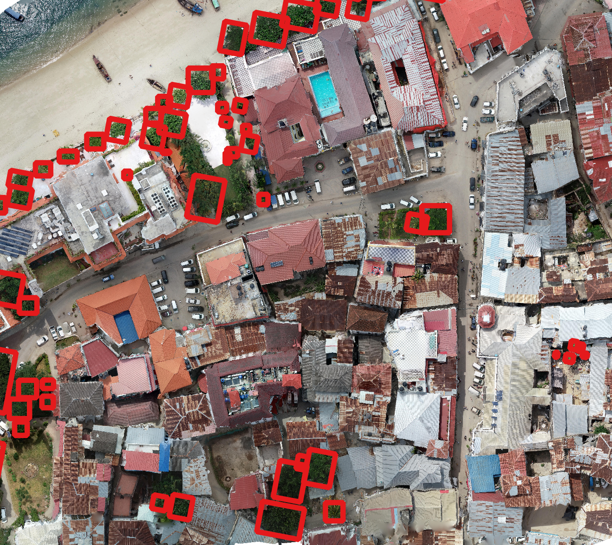

The MillionAnimals Benchmark for Airborne Animal Detection
=======================================================

The MillionAnimals seeks to collect a million animal locations to create a global benchmark for machine learning models for airborne animal detection. Machine learning models need large amounts of data to generate realistic predictions. Existing benchmarks often have small amounts of data, often less than 10,000 animals, from single geographic locations and resolutions. The MillionAnimals will cover a range of backgrounds, taxa, focal views and resolutions from drones, aircraft, and satellite imagery. To make this possible, we need your help!

Current Status
--------------

There are 3 datasets available for the MillionAnimals benchmark:
 
* AnimalBoxes: A dataset of bounding boxes around animals from multiple sources.

* AnimalPolygons: A dataset of precise polygon annotations of animals from multiple sources.

* AnimalPoints: A dataset of point locations marking animal positions from multiple sources.

There are 3 split_schemes available for the MillionAnimals benchmark:

* Official: For each source, 80% of the data is used for training and 20% for testing.

* crossgeometry: Boxes and Points are used to predict polygons.

* zeroshot: Selected sources are entirely held out for testing.

Contact
-------

* Ben Weinstein, Research Scientist, Weecology Lab, University of Florida.
  ben.weinstein@weecology.org or make an issue on the `repo <https://github.com/weecology/MillionAnimals>`_

Why do we need this benchmark?
------------------------------

Wildlife monitoring is critical for conservation, ecosystem management, and understanding biodiversity patterns. The growth in airborne acquisition tools, particularly drones, has led to many attempts to detect and count animals from aerial perspectives. At the core of many of these methods is the need to identify individual animals to further process for species identification, population counts, behavior analysis, or health assessment. There have been dozens, if not hundreds, of articles predicting animal locations from airborne sensors. Here we focus on *RGB images* due to their low cost, uniform calibration across manufacturers and high resolution. The vast majority of research articles assess proposed algorithms at one or two locations, often with single species and with little understanding about generalization across environments, sensors, resolutions, focal views and taxa. To move beyond the duplication and static constriction of the field, we need to tackle a unified concept of animal detection that can be useful across a range of ecosystems, animal densities and taxonomy, as well as handle data from many input types, sensors and focal views. Models should be robust to different backgrounds and be quickly customized to new datasets.

.. toctree::
   :maxdepth: 2
   :caption: User Guide:

   getting_started
   datasets
   dataset_structure
   training
   evaluation
   leaderboard
   contributing
   developer
   submission_guidelines
   source/modules.rst

